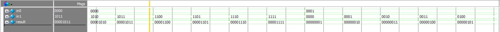
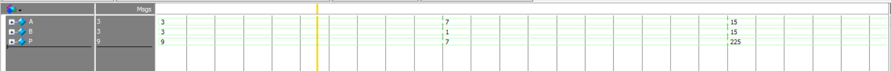
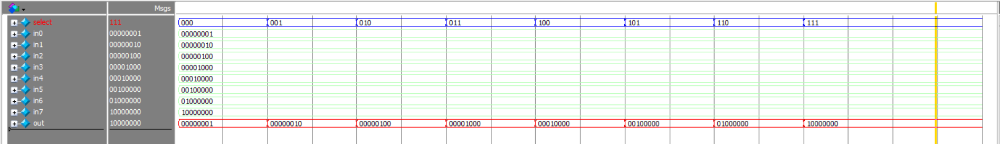
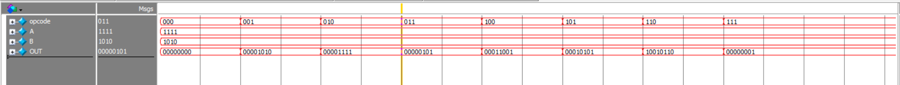

# ALU-8bit-verilog

This project implements a **4-bit Arithmetic Logic Unit (ALU)** in Verilog HDL.  
The ALU supports both **arithmetic** and **logic** operations, selectable through a 3-bit opcode.  

---

## Features
-Bock diagram 


- `000` → NOT A
- `001` → A AND B
- `010` → A OR B
- `011` → A XOR B
- `100` → A + B (Addition)
- `101` → A - B (Subtraction using Two’s Complement)
- `110` → A × B (Multiplication)
- `111` → A ÷ B (Division)

---

## Project Structure

```
| Source
	├── full_adder_1b.v      # 1-bit Full Adder
	├── full_adder_4b.v      # 4-bit Ripple Carry Adder
	├── subtractor_4b.v      # 4-bit Subtractor
	├── multiplier_4b.v      # 4-bit Multiplier
	├── divider_4b.v         # 4-bit Divider
	├── Mux_8to1.v           # 8-to-1 Multiplexer
	├── top_ALU_8b.v         # ALU Top Module
| testbench
	├── full_adder_4b_tb.v      #  testbench 4-bit Ripple Carry Adder
	├── subtractor_4b_tb.v      #testbench 4-bit Subtractor
	├── multiplier_4b_tb.v      ##testbench  4-bit Multiplier
	├── Mux_8to1_tb.v           ##testbench  8-to-1 Multiplexer
	└── top_ALU_8b_tb.v      # Testbench ALU Top Module
| wave form
	├── waveform_adder4bit.png
	├── waveform_multiplier.png
	├── waveform_Mux8to1.png
	├── waveform_ALU.png
           |blockdiagram.png 
```

---

## Tools

- Language: Verilog HDL  
- Simulator: Quartus ModelSim 
- Target: Educational purpose, digital design practice  

---


## Simulation result

-  Waveform module full_adder_4b   
   


- Waveform module multiplier_4b



- Waveform module Mux_8to1



- Waveform module top_ALU_8b         
          



## Authors
 
- Nguyễn Văn Thiện 
-email : thiennv17@gmail.com

